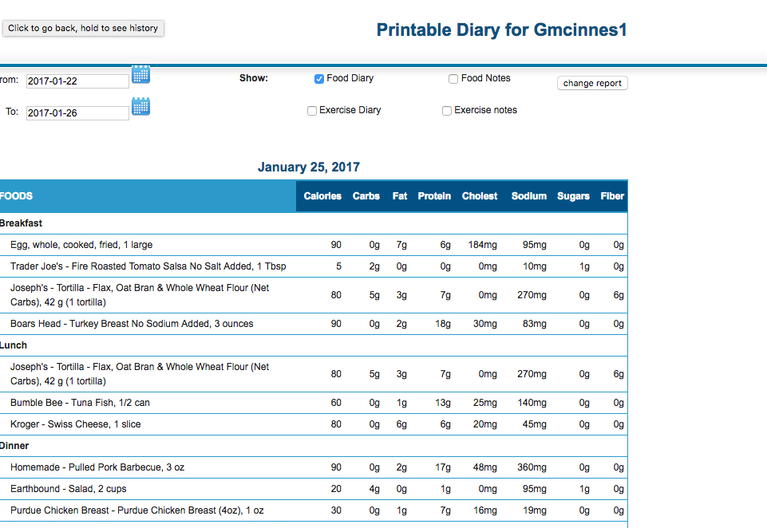

# Sending a Food Log from Myfitnesspal

Sending a weekly food log from myfitesspal is a bit of a pain, but you can do it from the myfitnesspall website (I don't think you can do it from the phone apps).

1. Log in to myfitnesspal
Go to the [myfitnespal login page](https://www.myfitnesspal.com/) at https://www.myfitnesspal.com and click "Log In" on the top right.  Log in with your email address and password

2. Once you're logged in, navigate to your _food diary_ by clicking the items shown below

3. Then go to the bottom of that _food diary_ page and click on "View Full Report (Printable).

4. That should take you to the report page.  Now you have to use the date pickers to select the date range you want to report on. And you have to make sure that only the _Food Diary_ checkbox is checked (turn the other three off).  And then click "Change Report" to get the updated information.

5. Now you should have a report that contains all of your _food diary_ entries for the week.  You can print this report using your regular browser print function.  See what I mean below:

6.  But you can also use your computer's "Save to PDF" function in the _print_ dialog to save the ready to print report as a pdf. How to do that varies depending on what kind of computer you have, but you should be able to Google how to do it.

7. Once it's printed, you end up with a nice pdf file, like the one shown below, that you can email to Pam or Taylor, for their comments and help.

